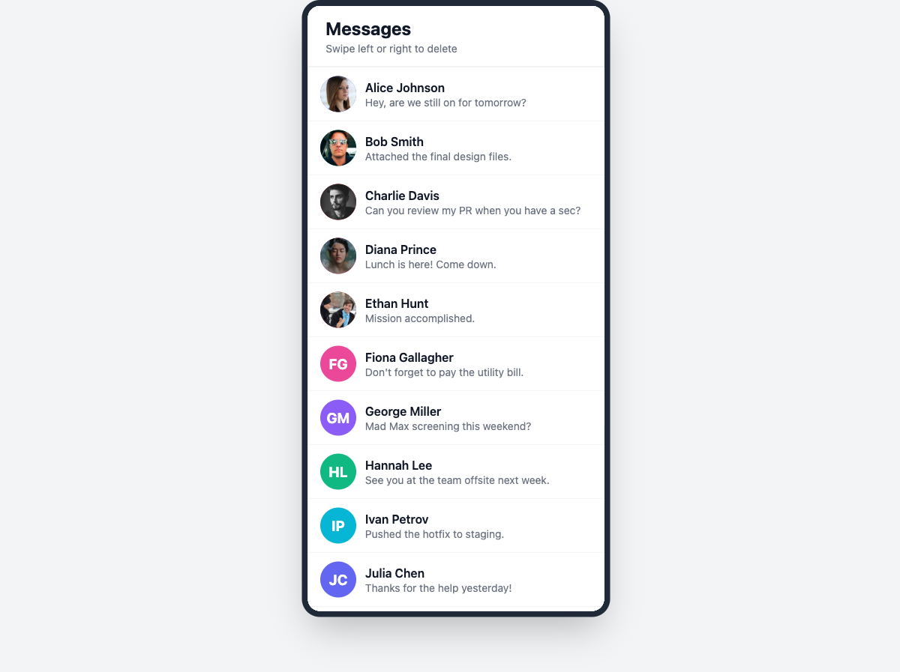

# ibit — cross-platform swipeable message list

A technical assignment implementing one feature — a swipeable message list
with 1,000 rows — as a single shared TypeScript codebase running on **iOS**,
**Android** and **Web**. Rows carry an avatar that falls back to colored
initials when the image is missing or broken; dragging a row left or right
past a 120px threshold slides it away and collapses it, with gesture-driven
motion kept off the React render path.



## What it does

- 1,000-item list, virtualized via `FlatList` (fixed row height + `getItemLayout`)
- Reusable cross-platform `Avatar` component (`@ibit/ui`)
- Two avatar states exercised by the mock data — valid image and missing
  image — with the broken-image fallback covered by Avatar unit tests; all
  paths fall back to deterministic colored initials
- Bidirectional swipe-to-delete (left or right)
- Strict threshold: past 120px deletes, below it the row snaps back
- Animated removal: slide-out → collapse → a single React state commit
- Web supports mouse drag and touch; vertical scrolling wins over horizontal
  drags on every platform
- The same application code runs on iOS, Android and Web

## Tech stack

| Concern              | Choice                                                                  |
| -------------------- | ----------------------------------------------------------------------- |
| UI runtime           | React 19 · React Native 0.87 (New Architecture) · React Native Web 0.21 |
| Gestures / animation | React Native Gesture Handler 3 · Reanimated 4 (+ worklets)              |
| Language             | TypeScript 5.9, strict mode                                             |
| Web bundler          | Vite 7                                                                  |
| Workspace / tooling  | npm workspaces · Vitest 3 · ESLint 9                                    |

No Expo — the native apps are bare React Native projects.

## Repository structure

```
apps/
  mobile/    @ibit/mobile — bare RN shell: native entry, Metro/Babel config, ios/ + android/ projects
  web/       @ibit/web    — Vite shell: web entry, RN→RNW alias, desktop bezel CSS
packages/
  app/       @ibit/app    — the shared application (feature code + composition root)
  ui/        @ibit/ui     — reusable primitives (Avatar)
```

Dependency direction is one-way: `apps/* → @ibit/app → @ibit/ui`.
See [docs/ARCHITECTURE.md](docs/ARCHITECTURE.md) for how this is wired and why.

## Getting started

Prerequisites:

| Tool                          | Version             | Needed for |
| ----------------------------- | ------------------- | ---------- |
| Node.js                       | ≥ 22.13             | everything |
| JDK 17 + Android Studio / SDK | recent              | Android    |
| Xcode + CocoaPods ≥ 1.15      | recent (macOS only) | iOS        |

```bash
npm install

npm run web        # Vite dev server → http://localhost:5173
npm run ios        # pod install + build + launch on an iOS simulator
npm run android    # build + launch on an Android emulator/device
```

Notes:

- `npm run ios` chains `pod install`, so a fresh clone needs no manual
  CocoaPods step (first run takes a few minutes).
- Native runs need a booted simulator/emulator or an attached device.

## Quality checks

```bash
npm run typecheck  # tsc across all four workspaces (strict)
npm run lint       # ESLint flat config
npm test           # Vitest — 35 tests across 6 files
npm run build:web  # production web build → apps/web/dist
```

All four pass at the current commit. Per-check results and platform
verification: [docs/VERIFICATION.md](docs/VERIFICATION.md).

## Implementation highlights

- One shared RN/RNW application package; platform shells contribute only
  entry files and bundler/native configuration (no `.web.tsx` /
  `.native.tsx` splits anywhere).
- `FlatList` virtualization with fixed row height and O(1) layout math;
  memoized rows with stable callbacks so a deletion re-renders nothing else.
- Gestures write Reanimated SharedValues inside worklets; animated styles
  read them directly — no per-frame React state.
- React state is updated once per deletion, after the removal animation
  commits (`scheduleOnRN`).
- Deterministic avatar fallback: initials are always rendered beneath the
  image, so error handling causes zero layout shift.
- Local React state chosen deliberately over a global store — one list, one
  operation, one reset.

## Platform notes

- On iOS/Android, gesture callbacks run as worklets on the UI runtime (JSI);
  React is not involved while dragging.
- On Web the same code runs on the main thread through React Native Web —
  browsers have no UI-thread worklet runtime. Behavior is identical; the
  execution context differs and is documented rather than hidden.
- Hermes is enabled on Android (confirmed present in release builds).
- Snap-back uses `withTiming` with a fixed bezier instead of `withSpring`,
  matching the reference prototype's easing and keeping the interaction
  deterministic across platforms.
- Avatars load from `i.pravatar.cc`; offline runs show the initials fallback
  for those rows — the fallback working as designed.

## Verification

Web was verified live against the production build: render, virtualization,
both swipe directions, threshold snap-back, rapid deletions, avatar states
and mouse drag. Android debug/release/AAB builds pass with Hermes confirmed in
the release APK; render and mid-swipe were captured on an emulator. The iOS
simulator build passes; launch, render and avatar fallback were confirmed on a
clean-room capture, but interactive swipe was not executed — touch injection
is not possible in the verification environment (synthetic mouse clicks reach
the Simulator but synthetic drags are not translated into touch gestures);
this is disclosed truthfully.

Details and per-check results: [docs/VERIFICATION.md](docs/VERIFICATION.md).

## Design decisions

Package boundaries, the gesture pipeline, list strategy, state management and
the deliberate non-goals are documented in
[docs/ARCHITECTURE.md](docs/ARCHITECTURE.md).
