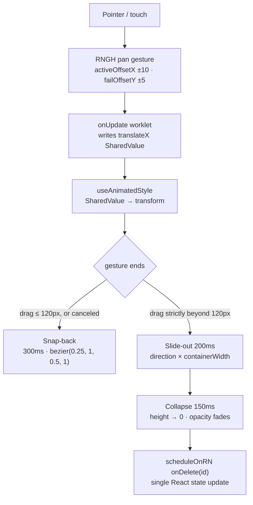

# Architecture

## Goals

The assignment fixes the constraints; the design follows from them:

- One feature — a swipeable message list — running on **Web and React Native**
  from shared UI/application code.
- **1,000+ rows** must scroll smoothly, so virtualization is mandatory.
- Swipe gestures must animate smoothly, which pushes motion off the React
  render path (Reanimated SharedValues driven from worklets).
- **No Expo**: bare React Native projects.

Everything else — persistence, navigation, backend — is intentionally absent
(see [Deliberate non-goals](#deliberate-non-goals)).

## Package architecture

```
apps/mobile ─┐
             ├─> @ibit/app ─> @ibit/ui
apps/web ────┘
```

- `@ibit/app` holds the entire feature: the list screen, the swipeable row,
  the deletion model and the composition root. It exports a single `<App />`.
- `@ibit/ui` holds reusable primitives; today that is `Avatar`.
- The platform apps are thin shells on purpose: each contributes only an entry
  file, bundler configuration and (for mobile) the generated native projects.
  All product code lives in `packages/*`, so a behavior change lands once and
  applies to every platform.

Dependency rules:

- Direction is one-way: `apps/* → @ibit/app → @ibit/ui`. Upward imports are
  forbidden.
- Shared packages declare `react`, `react-native`,
  `react-native-gesture-handler`, `react-native-reanimated` (and
  `react-native-safe-area-context` for `@ibit/app`) as **peerDependencies**;
  real dependencies are installed only by the apps. This keeps RN autolinking
  correct — native modules are linked once, by the app that owns the native
  project.
- Shared packages ship TypeScript source with no build step: Metro transforms
  them via `watchFolders`, Vite transpiles them through `@vitejs/plugin-react`.
  In both bundlers the worklets Babel plugin must run last in the pipeline.
- npm workspaces hoist dependencies into a conventional root `node_modules` —
  the layout Metro, Gradle and CocoaPods expect.

## Cross-platform strategy

The web app renders the same component tree through **React Native Web**: Vite
aliases `react-native` → `react-native-web`, and `.web.*` extensions would
resolve first if a platform override were ever needed (none exists — there are
no `.web.tsx` / `.native.tsx` splits anywhere in the repository).

What is shared versus platform-specific:

| Layer                     | Location                      | Contents                                                       |
| ------------------------- | ----------------------------- | -------------------------------------------------------------- |
| Shared application code   | `packages/app`, `packages/ui` | List screen, swipeable row, deletion model, theme, Avatar      |
| Web shell                 | `apps/web`                    | `main.tsx`, Vite config, ~44 lines of desktop bezel CSS        |
| Native shell              | `apps/mobile`                 | `index.js`, Metro/Babel config, Metro-ensure script            |
| Generated native projects | `apps/mobile/{ios,android}`   | Xcode / Gradle projects, essentially untouched template output |

The large majority of authored application code is shared between platforms;
the shells exist to bootstrap the same `@ibit/app` tree on each runtime.

## List architecture

`FlatList` with fixed-height rows:

- `ROW_HEIGHT = 72` for every row; `getItemLayout` returns
  `{ length, offset: ROW_HEIGHT * index, index }` — no per-item measurement,
  O(1) offset math for scroll positioning.
- `keyExtractor` returns the stable item id, never the array index, so rows
  keep their identity across deletions.
- `SwipeableRow` is wrapped in `React.memo`; `onDelete` and `renderItem` are
  `useCallback`'d; deletion uses an identity-preserving `filter`, so surviving
  rows' props never change and neighbors never re-render.
- Window props (`initialNumToRender`, `windowSize`, `maxToRenderPerBatch`)
  stay at library defaults — verification never required tuning them.
- `removeClippedSubviews={false}`: view clipping interacts badly with the
  absolutely-positioned swipe underlay on Android; it is a no-op on web.

A plain `ScrollView` + `.map()` was inappropriate: it mounts every subtree, so
all 1,000 rows would each carry gesture handlers and animated nodes regardless
of visibility. Virtualization keeps only the visible window mounted —
deep-scroll verification measured 30 mounted rows at a 40,000px offset.

FlashList was unnecessary for this fixed-height 1,000-row case. Its recycling
model would require explicit reset bookkeeping for per-row SharedValues, while
FlatList with `getItemLayout` already met the performance requirements.

## Gesture and animation pipeline



Key properties:

- **No per-frame React state.** The drag writes `translateX.value` inside a
  worklet; `useAnimatedStyle` reads it. React never renders during a drag.
- **Strict threshold semantics**: deletion commits only when
  `Math.abs(translationX) > SWIPE_THRESHOLD` (120px), matching the prototype.
- **Snap-back** animates to rest over 300ms with the prototype's exact easing,
  both for sub-threshold releases and system-canceled gestures
  (`event.canceled`).
- **Deletion is a manual three-phase lifecycle**: slide-out (200ms) → collapse
  with fade (150ms) → one `scheduleOnRN(onDelete, item.id)` call. Manual
  phasing is deliberate: Reanimated `entering`/`exiting`/`layout` animations
  misbehave inside FlatList on Android (upstream issue #5728).
- **Re-entry guard**: an `isDeleting` SharedValue makes gesture callbacks
  ignore further events once deletion starts, so rapid swipes cannot
  double-fire. Deletion itself is idempotent — it filters by stable id.
- **Unmount safety**: if a row unmounts mid-animation (for example scrolled
  out of the window), a `useEffect` cleanup commits its pending deletion
  synchronously.
- The red delete background sits behind the row on both sides; its opacity
  interpolates 0.5→1 across the threshold, derived from the same SharedValue.
- **Scroll arbitration**: `activeOffsetX ±10` activates the pan only for
  mostly-horizontal movement, `failOffsetY ±5` yields early to vertical
  scrolling, and `touchAction="pan-y"` lets the browser keep vertical control
  on web.

## State management

Local React state, deliberately:

```tsx
const [items, setItems] = useState(() => createMockItems(1000));
```

The feature has one collection, one operation (delete), and one reset. A store
library would add a dependency, provider wiring and indirection without
removing any complexity that actually exists. `deleteItem` is a pure,
identity-preserving `filter`: survivors keep object identity, which is exactly
what lets memoized rows skip re-render. If scope grew (filters, multiple
screens, server sync), a store would become justified — at this size it is
ceremony.

## Avatar

`Avatar` (`@ibit/ui`) is a self-contained cross-platform primitive:

- Initials are **always rendered** as the base layer; the image, when present,
  is absolutely positioned on top (`StyleSheet.absoluteFill`).
- `onError` flips local `failed` state, unmounting only the image layer — the
  initials beneath are already laid out, so failure causes **zero layout
  shift**.
- Background color comes from a deterministic djb2 hash of the name into a
  small palette, so a given person always gets the same color.
- `accessibilityLabel={name}`; initials are hidden from accessibility when the
  photo is shown.
- Mock data exercises both remaining states by construction (80% valid /
  20% missing); the broken-image fallback is exercised by Avatar unit tests
  rather than live unresolvable URLs.

## Platform-specific concerns

- **React Native Web** implements the RN primitives used here (FlatList,
  StyleSheet, Image) faithfully; aliasing and the required globals (`__DEV__`,
  `_WORKLET`, …) live in `apps/web/vite.config.ts`.
- **Gesture Handler on web**: mouse and touch both drive the pan gesture;
  `touchAction="pan-y"` preserves normal vertical list scrolling.
- **Native UI runtime**: on iOS/Android, worklets execute on the UI thread via
  JSI and animations continue even if JS is busy. On web the same worklet code
  runs on the main thread — identical behavior, different scheduler.
- **Hermes**: enabled on Android; `libhermesvm.so` ships in release builds for
  all ABIs, with the hoisted `hermesc` path wired through Gradle.
- **Safe area**: `react-native-safe-area-context` is a peer of `@ibit/app` so
  shared code can respect insets on notched devices.
- **Monorepo wiring**: Metro gets `watchFolders: [workspaceRoot]` and dual
  `nodeModulesPaths`; Vite dedupes react/RNW and prebundles the RN compat
  packages.

## Performance

Measures that matter at 1,000 rows:

- Virtualization via FlatList + `getItemLayout` (fixed 72px): mount cost is
  constant regardless of data size. Verified live: 30 rows mounted at a
  40,000px scroll offset.
- Stable identity end-to-end (stable ids, memoized rows, stable callbacks,
  identity-preserving deletion): deleting a row re-renders only the list
  container; untouched rows do not re-render.
- The gesture path costs nothing per frame in React: worklet → SharedValue →
  animated style. A development-time render-count probe confirmed zero React
  re-renders during drags.

A 10,000-item stress run was performed during development (Web content height
scaled exactly 10× with only the window mounted; the Android emulator behaved
as at 1k). It is development-time evidence, not part of the shipped
configuration — the app ships with 1,000 items.

No FPS or frame-time benchmarks were recorded; the statements above are
structural measurements (mount counts, render counts), not timing claims.

## Deliberate non-goals

Scope discipline, not missing functionality:

- **Persistence** — the assignment defines an in-memory list; a storage seam
  would be dead abstraction.
- **Navigation** — one screen; a router adds weight with nothing to route.
- **Global state manager** — covered above; local state is the right size.
- **Design-system dependency** — two primitives and a theme file cover the
  surface; adopting a library would outsource roughly two hundred lines of
  styling.
- **Expo** — excluded by the brief; bare projects also keep autolinking and
  Hermes configuration explicit.
- **Backend/API abstraction** — mock data is a pure function of the item
  index; there is no network boundary to abstract.

## Trade-offs

Real trade-offs, made consciously:

- **Manual deletion lifecycle** instead of Reanimated layout animations: more
  explicit code, but immune to the FlatList/Android layout-animation bug.
- **`withTiming` snap-back** instead of `withSpring`: chosen to match the
  reference prototype's easing and keep the interaction deterministic across
  platforms.
- **Debug-signed release build** (RN template default): acceptable for an
  assignment; production distribution would need real signing keys.
- **Single Vite chunk** (~703KB raw / ~209KB gzip): code-splitting would add
  configuration for no practical benefit at this size; the resulting build
  warning is acknowledged in [VERIFICATION.md](VERIFICATION.md).
